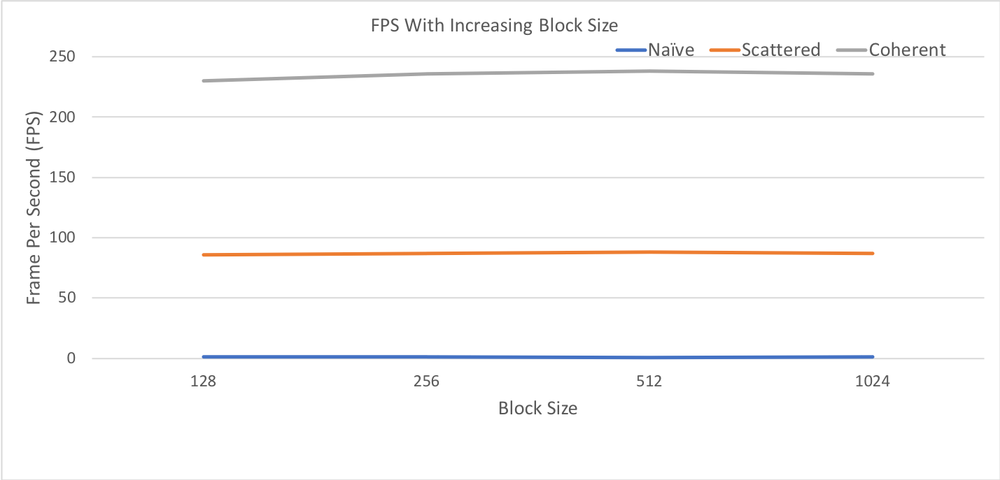

**University of Pennsylvania, CIS 565: GPU Programming and Architecture,
Project 1 - Flocking**

* SOMANSHU AGARWAL
  * [LinkedIn](https://www.linkedin.com/in/somanshu25)
* Tested on: Windows 10, i7-6700 @ 3.4GHz 16GB, Quadro P 100 12 233MB (Moore 100B Lab)

### OBJECTIVE

The main motive of the project is to visualize Boids flocking and do the performance analysis on three implementation ways of flocking: naive, scattered and coherent search. The search was to find the relevant neigbours of each boid and its position and velocity is updates with respect to its neighbours thorugh the three rules: adhesion, dodging and cohesion. The brief implemetation details of these 3 ways and the performance analysis is given below.

## 1. Naive Implementation

In the naive implementation, got a particluar boid, we are searching all the other boids and then selecting the relevant neighbours for the position and velocity update of the boid. This for every boid, we are checking other N-1 boids, which is time consuming and inefficient when N is large. 

### Grid System
For the rest of the 2 implementation, we are creating a grid system in which we are enclosing the whole space in a cube with grid cell width setting by the user according to the requirements. With changing the gird cell width, the grid resoltion and the grid cell count will vary and its impact on the performance is also studies in this project. By using the grid system, we are labelling each boid to a grid cell index.

## 2. Scattered 

In this implementation, we are limiting our search for the boids which are labelled in the cells of the neighbourhood distance we need to check. Thus, we are checking those grid cells which could be enclosed in the sphere inside the cube with the radius as the neighbouring distance. The number of cells enclosed would differ with the length of the grid cells. Having grid width of twice the maximum neighbourhood distance will take 8 cells while the length equal to maximum neighbouring dustance will take 27 cells. For making sure we are selecting those cells which are enclised in the grid cells, we are sorting the array of boid indexes with respect to the grid indexes labelled and then when we select the particular cell index, we get the range of boids we need to check.

## 3. Coherent

In this implememntation, we do further optimization in our code by reshuffling the position and velocity boid data with the sorted nboid particluar array indexes so that the memory access of the boid data is also contgous and there will be more cache hits and less misses, which would save the runtime. Thus, we only need the start and end indexes of the boids which are present in the cell to access the boid data rather than the boid array indexes we require in our scattered implementation.

# Performance Analysis:

Here are ther graphs showing the frame rate per second of the three implementations when we change the number of boids in the siimulation:

1 .The graphs showing the FPS with and without visualization for increasing the number of Boids in simulation for all the 3 implementations are:

We can see from both the above graphs that FPS rates are more witout visualization. 
2. The graphs showing increasing the block size for all the 3 implementations are:

3. The graph for observing the grid cell width is 2*(neighbouring distance) vs when grid cell width is neighbouring distance is shown below, where the neighbouring distance is the maximum of all the ruleDistances for the neighbour checks.

## Answers to the questions:
### For each implementation, how does changing the number of boids affect performance? Why do you think this is?
We can see in the graphs above that as the number of boids increase, the performance will decrease as there would be more number of neighbours and boids to check for earch reference boid and thus will increase the runtime. The impact can be seen same in all the 3 implementations, we can observe that the perofrmance is bettern in coherent for higher number of boids as compared to rest of the 2 implementations.

### For each implementation, how does changing the block count and block size affect performance? Why do you think this is?
With the graph of increasing the block size for all the 3 implementations, we can see that the performance is almost same if we are using the block sioze equal to the multiples of warp size, i.e., 32. We can infer with the fact that the numebr of threads that are released are same even if the block size are increasing.

### For the coherent uniform grid: did you experience any performance improvements with the more coherent uniform grid? Was this the outcome you expected? Why or why not?
For coherent uniform grid, we see the improved performance with respect to the scattered one

### Did changing cell width and checking 27 vs 8 neighboring cells affect performance? Why or why not? Be careful: it is insufficient (and possibly incorrect) to say that 27-cell is slower simply because there are more cells to check!
After plotting the line graph for 8 vs 27 neighbouring cells for scattered implementation, we observe that the 27 neighbouring cells is giving slightly better performance as compared to 8 neighbouring cells. One reason could be the smaller cell width will result in more number of grid cells which will include less number of boids as the cells are smaller. Thus, as compare to larger grid cells, it would check the boids which are more probably wthin the neighbouring distance of the boid as the larger cells would have to search the boids which could be farther but just indide the cells. Hence, the performance is slightly better with smaller grid width.

